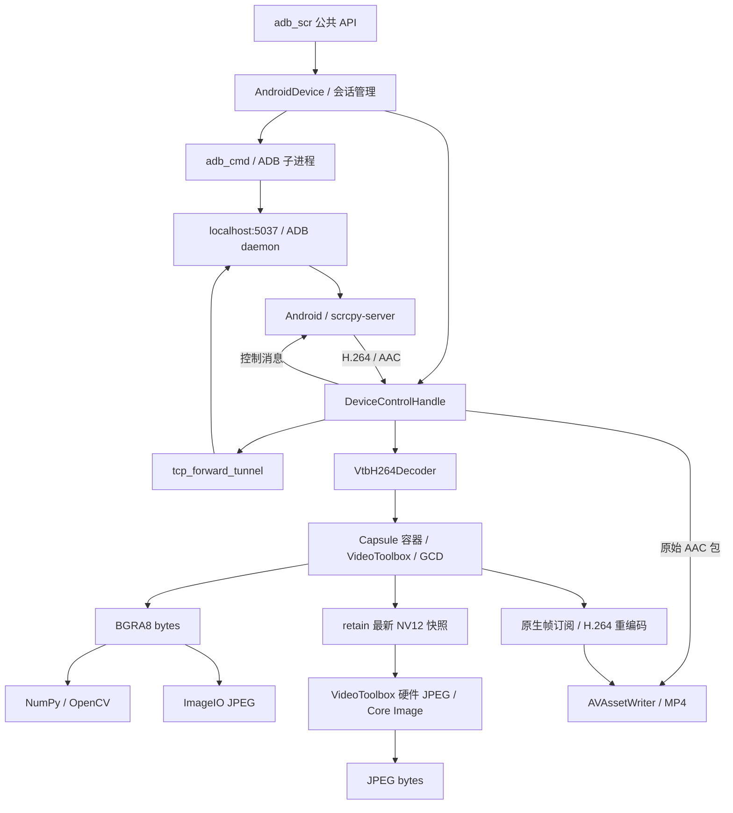

# 当前系统架构

本文描述当前工作树的模块职责、会话生命周期及并发边界。公共接口见 [api.md](api.md)，原始设计背景见 [control-flow.md](control-flow.md)，构建和版本验证见 [python-compatibility.md](python-compatibility.md)。契约改变时同步更新这些文档。

## 定位与边界

`adb_scr_py` 的 Python 导入名为 `adb_scr`，通过 ADB 和 scrcpy 3.2 控制 Android 并接收 H.264 视频。最低支持 Python 3.10，默认开发版本为 3.14。原生媒体实现仅支持 macOS，并要求 VideoToolbox 硬件解码。

库缓存最新 NV12 解码帧，按需用 Accelerate/vImage 转成 BGRA8，服务于高频 NumPy/OpenCV 图像处理。顶层 `AndroidDevice.get_screenshot_jpg()` 直接从 CVPixelBuffer 编码 JPEG，支持质量、缩放比例及原图 ROI；调用者无需选择底层编码路径。内部控制句柄仍可返回原始 BGRA8 bytes，原生 `bgra8_to_jpg()` 工具函数也继续保留。没有历史帧队列或自动重连。屏幕录制订阅同一原生 NV12 帧，独立使用 VideoToolbox 编码 H.264，并将 scrcpy 回传的 AAC 直接封装进 MP4。

## 模块与数据流

| 文件 | 职责 |
| --- | --- |
| `src/adb_scr/__init__.py` | 初始化/反初始化、设备枚举、FPS 配置及公开导出 |
| `consts.py` | 进程级可变配置；始终通过 `consts.XXX` 读取 |
| `async_utils.py` | 在取消时等待已取得所有权的操作完成；关闭流、终止并回收子进程 |
| `adb_cmd/base.py` | 有超时和取消清理的 ADB 子进程执行；设备枚举、transport 连接等 |
| `adb_cmd/device_control.py` | 推送、应用命令、启动并转交 scrcpy 进程所有权 |
| `device/options.py` | 不可变、经验证的公开 `ConnectionOptions` |
| `device/android_device.py` | 连接、回滚、会话监控、断连通知、显式重连、截图和手势 |
| `device/control_handle.py` | 视频/可选音频/控制流、接收任务、解码器替换、控制发送、幂等关闭 |
| `device/audio_stream.py` | scrcpy AAC 编码器头、配置和带 PTS 的包解析；区分禁用和异常断流 |
| `device/recording.py` | 录制 start/stop/取消所有权、音频入队、PTS/单调时钟映射及错误保存 |
| `device/tcp_forward_tunnel.py` | 一次有总超时的 TCP + ADB 握手；失败回收流 |
| `device/types.py` / `bin_utils.py` | 连接/手势类型、整数编码、帧头及随机延时 |
| `media_ext/h264/` | 同步快速入队、异步取帧/关闭及首个 IDR 约束 |
| `media_ext/_adb_scr_media.pyi` | 原生公共函数的类型与 docstring；方法表不放 C docstring |
| `native_code/macOS/src/adb_scr_media.c` | Python/C 转换；稳定 Capsule 容器、句柄锁、析构兜底 |
| `vtb_decoder.c` | VideoToolbox session、回调、最新帧串行队列、原生帧观察者及有序销毁 |
| `recording.m` | 有界媒体提交、H.264 编码、AAC 压缩包封装、尺寸适配和文件收尾 |
| `vtb_helper.c` | Annex B 处理及 NV12 → BGRA8 转换 |
| `jpg_encoder.c` | ImageIO/CoreGraphics JPEG 编码 |
| `frame_jpg_encoder.m` | NV12 直接编码 JPEG；复用硬件会话及 Core Image 上下文，裁剪、缩放和回退 |

## 初始化与连接所有权

`init_lib()` 在模块锁内释放包内服务端资源、获取 ADB 版本并启动共享 daemon。必须先逐台 `disconnect()`，再 `deinit_lib()`；反初始化不枚举设备对象，停止 daemon 会影响其他 ADB 客户端。

每次 `AndroidDevice.connect()` 在设备锁内清理失效会话，再建立新的断连通知对象。一次连接受 `connect_timeout` 预算约束：

1. TCP 设备执行 `adb connect`；USB 设备略过。
2. 执行 `getprop ro.build.version.sdk` 读取 API 级别，查询失败使连接回滚；推送服务端到 `/data/local/tmp/scrcpy-server.jar`。
3. 启动 scrcpy 3.2，配置 H.264、视频/控制开启；API >= 33 使用 AAC + playback + audio_dup，30–32 使用 AAC + output，低于 30 关闭音频。保留原有 2 秒启动缓冲。
4. 保存进程和控制句柄的所有权；按视频、可选音频、控制顺序连接同一个 `localabstract:scrcpy_SCID`。
5. 所需流全部取得后设置 `running=True` 并启动接收任务；等待有效视频元数据，启用音频时同时等待初始 AAC 配置或明确禁用状态。
6. 确认进程和流仍有效，启动会话监控，再返回 True。

`connect()` 成功只保证流和有效尺寸就绪，首个解码帧可能稍后到达。普通失败或超时完整回滚后返回 False；取消完成回滚后传播 `CancelledError`。同一实例允许显式再次连接，不自动重连。

单条隧道的超时覆盖 `open_connection()`、`host:transport:SERIAL` 和 UDS 应答。这里直接使用 ADB daemon 协议，没有执行 `adb forward` 创建额外监听端口。命令长度按 UTF-8 字节数编码。

FPS 是下一次启动服务端使用的进程级上限，不影响已运行会话；模块导入先后不影响 `consts.SCREEN_FPS` 的动态读取。

## 接收协议与故障检测

视频元数据为 1 字节确认、64 字节设备名、编码器 ID/宽/高各 4 字节，共 77 字节。必须确认 H.264 且尺寸为正。每个视频包由 8 字节标志/微秒 PTS、4 字节 payload 长度和 H.264 payload 组成。

包间允许无限静默；首字节到达后，剩余头和 payload 必须在一次 `io_timeout` 内收齐。当前单包大小限制为 1–64 MiB。半包超时后整会话关闭，不尝试从错位字节继续解析。

控制上行使用 `read(4096)` 分块消费，空 bytes 明确表示 EOF。正常静默没有超时，也不积攒到整个连接关闭才消费。控制下行 `write()` 后用有超时的 `drain()` 等待背压，发送失败触发会话停止；不提供手机 UI 执行确认。

监控同时等待控制句柄结束、scrcpy 子进程退出和可选的存活探测结果。探测默认每次完成后等待 5 秒，再执行有 5 秒超时的 `adb -s SERIAL shell true`，连续 3 次失败关闭；成功归零。它验证 transport/shell，不证明视频编码器仍在产帧。`probe_interval=None` 禁用主动探测。

## 手势状态与多指触控

`GestureActionNode.pointer_id` 默认 0，位于原有四个字段之后；同一根手指在 DOWN/MOVE/UP 间保持 ID。控制消息将该 ID 编码为 8 字节大端整数，替代旧的固定指针值；click、long_press、swipe 也统一使用默认 ID 0。scrcpy 3.2 根据活跃指针集合转换多指 DOWN/UP 的 Android 动作及索引，客户端仍发送基本 DOWN/MOVE/UP。协议依据见 [Controller.injectTouch](https://github.com/Genymobile/scrcpy/blob/v3.2/server/src/main/java/com/genymobile/scrcpy/control/Controller.java) 和 [PointersState](https://github.com/Genymobile/scrcpy/blob/v3.2/server/src/main/java/com/genymobile/scrcpy/control/PointersState.java)。

`action_series(check=True)` 在发送之前完整检查列表，按 ID 维护已按下的手指集合。DOWN 只能加入未按下的 ID；MOVE/UP 必须对应已按下的 ID，UP 将其移出；结束时集合必须为空。同一 ID 抬起后可以复用，不同 ID 可以交错操作，最多同时按下 10 根手指。单看 DOWN/UP 总数无法识别错误的手指配对。所有模式均预先检查坐标和 ID 的整数范围（0 到 `2**63 - 1`）；check=False 只跳过数量、时长和状态校验。

校验失败记录日志并返回，不发送任何节点。校验成功后仍在设备锁内逐个发送及等待；节点顺序和每个节点后的随机间隔保持原有语义。该校验仅针对本次列表，不追踪跨调用触点，也不保证断连/取消后最终 UP 的送达。

## 关闭与取消

控制句柄只创建一个清理任务，首次原因获保留。停止信号立即令 `running=False` 并唤醒手势等待。清理取消并等待接收任务、关闭所有流，结束录制并等待 MP4 完成，再在解码器锁内关闭解码器并清零尺寸。关闭流等待超时后 abort transport。

设备监控在发出停止信号后取消并等待其他监控任务（含在途探测命令），再在设备锁内回收控制句柄、scrcpy 进程及本会话使用的 TCP transport。手势等待在停止信号到达时提前结束，不再用长按时长拖延断连清理。已进行的普通 ADB 应用命令仍有自身超时，可能延后锁的取得。

子进程终止处理允许进程已退出，kill 后排空捕获的 PIPE 并等待回收，避免暂停的输出流阻止 transport 关闭。失败清理尽可能完成所有资源回收，并记录各项异常。

`wait_disconnected()` 等待调用开始时的会话通知，返回原因；旧等待者不会被重连覆盖。取消这个等待本身不关闭会话。主动 `disconnect()` 幂等，取消时会等待已经开始的清理完成。

`complete_on_cancel()` 保存异步任务的强引用，用 shield 防止调用方取消被传播到已经拥有资源的工作；收到取消后仍等待工作结束再传播取消。它用于原生工作、解码器安装、子进程创建/回收和清理。取消不等于工作线程停止；创建解码器的结果安装也属于保护范围，避免结果因取消而丢失。

网络超时启动取消和清理，实际返回可能晚于配置值。原生 VideoToolbox/GCD 销毁无强制超时；宁可等待在途工作完成，也不释放仍被引用的内存。

## 原生帧与句柄生命周期

Capsule 指向稳定的容器，容器持有 `decoder` 指针和原生互斥锁。读取、入队和销毁先取得该锁；销毁清空容器内指针。重复销毁无操作，关闭后取帧返回 None、入队返回 False。Capsule 析构作为资源兜底，显式关闭仍是调用约定。

VideoToolbox 输出回调 retain 图像后，将替换工作提交到解码器的 GCD 串行队列。最新帧替换与 BGRA8 转换均在该队列内执行。转换检查像素锁定返回值，用只读锁配对解锁；Python 最终得到独立 bytes。

JPEG 直出在 GCD 队列内取得 retain 的帧快照，随后在队列外编码；编码期间即使当前帧被替换，快照仍存活。原生句柄锁保护快照取得、编码器状态和关闭，Python 控制句柄锁仍协调入队、解码器替换及取图。取消须等工作线程结束后才释放这些保护。编码结果复制为独立 Python JPEG bytes，不产生 Python BGRA8 中间数据。

每个 Capsule 按需持有一个 JPEG 编码器。`roi=None, scale=1.0` 时尝试要求硬件加速的 VideoToolbox JPEG session，按输入尺寸复用并使用递增时间戳；每次请求更新质量。创建、参数设置或编码失败后，同一尺寸后续请求使用 Core Image，直到编码器重新创建或输入尺寸变化。无需硬编码厂商 EncoderID。

裁剪、缩放及硬件回退使用复用的 CIContext；有 Metal 设备时使用 Metal，没有时用软件上下文。Core Image 读取 NV12，按原图左上角坐标转换 ROI，再裁剪、平移、缩放并输出 JPEG。使用 sRGB 输出色彩空间，不承诺跨编码器相同画质，也不将 Core Image 的 JPEG 压缩描述为全程 GPU 执行。宽高独立四舍五入，最少 1、最多 65535 像素；系统不支持的实际编码尺寸仍可能失败。具体参数和异常见 API 文档。

销毁顺序为：阻止同一句柄新操作 → 等待 VideoToolbox 异步回调 → invalidate/release session → 同步进入 GCD 队列，确认旧任务结束并释放最终帧 → 释放队列与 decoder → 清空容器指针。等待 VideoToolbox 不等于等待回调另行提交的 GCD block，必须保留后者的同步步骤。

创建、取帧、销毁从异步调用路径进入 `to_thread()`。原生句柄操作（含 JPEG 直出）先分离 Python 线程状态，再进入容器互斥锁；快速入队在正常控制句柄路径不与取帧/关闭竞争。`bgra8_to_jpg()` 也在原生编码期间分离线程状态。普通 CPython 下这会释放 GIL；free-threaded 构建下仍须保留，以便垃圾回收等需要全局协调的操作继续进行。JPEG 会话销毁前等待编码完成，CIContext 和色彩空间随 Capsule 关闭释放。

单阶段模块初始化在 `Py_GIL_DISABLED` 构建下声明 `Py_MOD_GIL_NOT_USED`，导入不会自动启用 GIL；普通 3.10/3.14 构建不引用该专用 API。分离期间不调用 Python 对象 API，参数解析和结果构造均在附着线程状态下进行。调用参数持有不可变 bytes、ROI tuple 和 Capsule 的引用；Capsule 的 pointer/name/destructor 创建后不再修改，关闭只改变容器内受锁保护的字段。最后一个引用释放时才执行 Capsule 析构，因此活跃调用不会与容器本身的释放重叠。

## 并发边界

| 机制 | 保护内容 |
| --- | --- |
| 模块级 asyncio 锁 | 库初始化/反初始化 |
| 设备 asyncio 锁 | 会话建立/回收、应用命令、指定手势序列 |
| 控制句柄 asyncio 锁 | 解码器创建/替换、取帧、入队、录制订阅切换和关闭 |
| 录制控制器 asyncio 锁 | start/stop 与 AAC 提交；停止获取解码器锁前先获取此锁 |
| Capsule 容器原生锁 | 同一原生 decoder 的操作、JPEG 编码器复用与销毁 |
| 每解码器 GCD 串行队列 | 当前 CVPixelBuffer 的替换、BGRA8 转换、JPEG 快照 retain 及最终释放 |

asyncio 锁只协调同一事件循环中的协程，不是操作系统线程锁。设备实例、初始化/反初始化和模块配置仍应由同一事件循环管理；free-threaded 支持不允许跨事件循环共享这些状态。原生工作线程依赖 Capsule mutex 和 GCD 队列实现同步，同一句柄串行，不同句柄及独立 BGRA8 → JPEG 调用可并行。进程内共享的 vImage 转换参数和 BGRA8 编码色彩空间经 `dispatch_once` 初始化后只读；其余编码状态按调用或句柄隔离。ADB daemon 仍在进程内共享。

## 构建与验证

原生扩展由 `setup.py` 构建；`CMakeLists.txt` 仅供 IDE 索引。wheel 使用具体 CPython 小版本 ABI；普通 3.14 的 `cp314` 与 free-threaded 3.14 的 `cp314t` ABI 需要分别构建，不能混用。本地默认环境仍为普通 3.14；3.10 和 3.14t 在独立临时环境验证，命令见 [Python 兼容性](python-compatibility.md)。本次不新增子解释器支持。`MANIFEST.in` 排除 `docs/`、`tests/`、`AGENTS.md`；sdist 保留原生源码/头文件和 scrcpy 资源，wheel 保留扩展、资源、`.pyi`、`py.typed`。

无设备测试覆盖 EOF/半包/握手超时、部分连接失败、取消、进程退出、显式重连、探测阈值、手势中断、管道排空、原生重复关闭、GCD 排队工作完成及合成 H.264 → BGRA8 → JPEG。free-threaded 验证检查导入和测试结束时 GIL 仍关闭，并覆盖编码线程状态、多线程共享不可变输入、同一句柄读写/关闭、独立解码器及 GC 下的 Capsule 析构。真机 `tests/test_run.py` 仅在明确请求时执行，默认兼容性核查只编译或收集它。

## 录制时间与资源边界

`RecordingController` 属于一个控制句柄，原生录制器独立于解码器。录制编码器使用系统默认码率、画质、Profile 和关键帧间隔，保留实时编码、预期帧率和禁止帧重排设置。开始时在解码器锁内取得原生首帧并创建录制；原生观察者由解码器帧队列保存引用。后续 SPS/PPS 到达时，旧解码器先解绑录制、排空和关闭，新解码器创建后再绑定同一录制。原生 recorder 自己保留最新帧，旋转和暂时无新解码帧都不会丢失尾帧。

音频有独立的接收任务和录制锁，不为等待截图而获取解码器锁。首部为四字节 `\0aac`，后续与视频一样使用 12 字节包头；配置包保存 AudioSpecificConfig，媒体包保留原始 AAC bytes 和设备 PTS。单音频包上限 1 MiB。首部和首次配置有超时，之后完整包之间允许静默；已开始的半包必须在 io_timeout 内完成。编码器 ID 0 是服务端明确禁用，仅保留视频/控制；ID 1、非法协议或异常 EOF 关闭会话并回收正在录制的文件。

设备音视频 PTS 共用微秒基准，控制器用收包时的本机单调时钟维护最小观测传输偏移。每次开始冻结同一时间原点，首个缓存视频帧强制从零开始；不把可能已静止数分钟的画面 PTS 当作当前时刻。结束时间在停止请求或断连信号时固定，后续排队和文件关闭时间不延长录制。音频直接按包裁剪，起止精度受 AAC 包时长限制，时钟映射也受实际传输延迟影响。

原生 AAC 直通把一包以内的 PTS 抖动归整到采样时钟；较大的向前跳变作为空白编辑在 MP4 收尾时保留。只有这种情况需要同目录临时文件及 AVMutableMovie 原生头部修正，成功后原子替换目标。音视频压缩内容不重新编码；向后重叠超过一包或超过 4096 个间隔会报告错误。停止标记使 Python 音频消费直接跳过录制锁，因此这一步文件收尾不阻塞仍连接的音频 socket。

开始和停止都保护整个资源所有权操作，包含原生线程返回后的句柄安装以及等待锁的停止任务。取消不会让后台线程继续使用已释放的句柄。正常停止先阻止音频提交，在解码器锁内解绑观察者，再排空原生编码/写入并结束 MP4；decoder 的释放在其后。原生提交必须有界，不能让文件写入反向阻塞解码器帧队列。原生队列/引用和具体编码配置见 control-flow.md。

`AndroidDevice` 保存最近的录制控制器引用，因此自动断连后调用 stop_recording 仍能取得该录制的写入错误。成功的重复停止无操作；新录制重置错误状态。低版本设备或明确禁用音频时允许纯视频录制并记录警告，绝不把音频编解码工作放到 Python。
