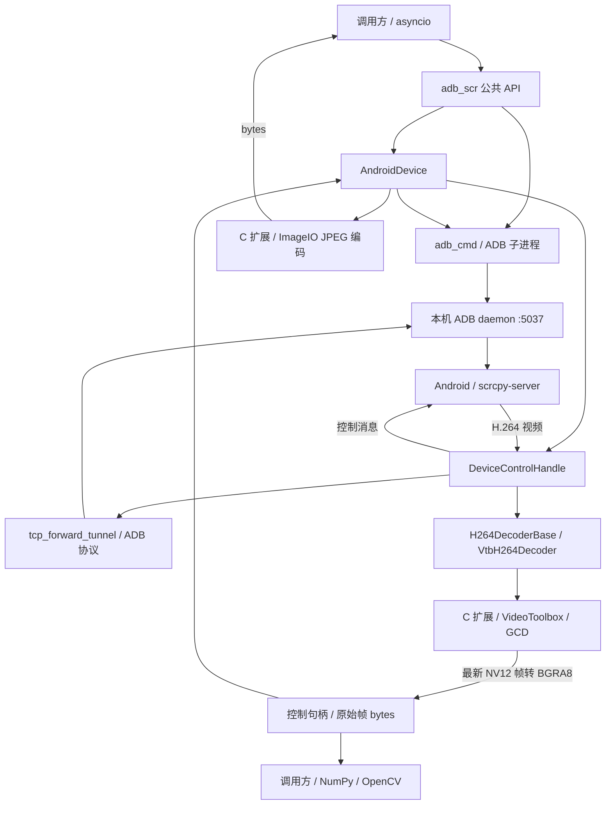

# 当前系统架构

本文描述 `adb_scr_py` 0.2.1 的现有实现，供后续 Agent 接手开发时定位代码和理解约束。模块职责、通信协议或资源生命周期发生变化时，应同步更新本文。开发命令见 [AGENTS.md](../AGENTS.md)，版本验证见 [Python 兼容性说明](python-compatibility.md)。

连接顺序、等待时间的原因、GCD 帧管理与 BGRA8/OpenCV 的设计初衷，详见 [控制流程、等待时序与取帧设计](control-flow.md)。

## 定位与运行边界

这是一个通过 ADB 和 scrcpy 服务端控制 Android 手机、持续接收屏幕视频并按需截图的 Python 库。发布包名是 `adb_scr_py`，导入名是 `adb_scr`。

原始设计目标包括频繁获取 BGRA8 像素供 OpenCV 矩阵处理。因此媒体层先提供原始帧，通过 Accelerate/vImage 的 CPU 向量加速将 NV12 转换为 BGRA8；JPEG 编码是其上的附加输出路径。当前原始帧入口位于控制句柄和解码器层，顶层 `AndroidDevice` 尚未提供独立的公开 BGRA8 取帧方法。

- 最低运行版本为 Python 3.10；本地开发和默认测试使用 Python 3.14。
- 当前构建与媒体实现仅支持 macOS，使用 CPython C 扩展和 Apple 系统框架；其他平台没有解码后端，`setup.py` 会拒绝构建。
- 主机需要可用的 ADB 可执行文件。USB 使用设备序列号，TCP 使用已经具备网络调试条件的 `IP:端口`。
- 包内包含 scrcpy 3.2 服务端，客户端按该版本的协议配置为 H.264 视频、启用控制、关闭音频。
- 当前只缓存最新解码帧，不提供视频录制、历史帧队列或自动重连。

## 分层与源码入口

图中的视频与控制消息均通过 ADB 隧道传输，Python 不直接连接手机上的独立 TCP 服务端口。

| 文件或目录 | 职责与边界 |
| --- | --- |
| [`src/adb_scr/__init__.py`](../src/adb_scr/__init__.py) | 库初始化/清理、设备枚举、公共 API 导出、下一次连接使用的帧率设置 |
| [`consts.py`](../src/adb_scr/consts.py) | 进程级可变配置：ADB 路径/版本、scrcpy 版本/路径、帧率 |
| [`logger.py`](../src/adb_scr/logger.py)、[`exceptions.py`](../src/adb_scr/exceptions.py) | 日志配置；初始化与解码器异常层次 |
| [`adb_cmd/base.py`](../src/adb_scr/adb_cmd/base.py) | 异步 ADB 子进程、daemon 启停、设备枚举、TCP 连接/断开、通用设备命令 |
| [`adb_cmd/device_control.py`](../src/adb_scr/adb_cmd/device_control.py) | 推送文件、启动/停止 App、启动 scrcpy 服务端 |
| [`device/android_device.py`](../src/adb_scr/device/android_device.py) | 每台设备的会话入口；编排连接、清理、截图与手势 API |
| [`device/control_handle.py`](../src/adb_scr/device/control_handle.py) | 两条 socket、两个接收任务、视频包解析、解码器切换与控制消息发送 |
| [`device/tcp_forward_tunnel.py`](../src/adb_scr/device/tcp_forward_tunnel.py) | 直接与本机 ADB daemon 握手，将流连接到手机上的 Unix domain socket |
| [`device/bin_utils.py`](../src/adb_scr/device/bin_utils.py)、[`device/types.py`](../src/adb_scr/device/types.py) | 大端序整数、视频帧标志、随机延时；连接类型、手势枚举和节点数据类 |
| [`media_ext/__init__.py`](../src/adb_scr/media_ext/__init__.py) | 导入 JPEG 编码函数，按平台创建 H.264 解码器 |
| [`media_ext/h264/decoder_base.py`](../src/adb_scr/media_ext/h264/decoder_base.py) | 解码器接口：同步入队、异步取帧、异步关闭 |
| [`media_ext/h264/vtb_decoder.py`](../src/adb_scr/media_ext/h264/vtb_decoder.py) | VideoToolbox 句柄封装、有效状态、首个 IDR 帧约束、线程调度 |
| [`media_ext/_adb_scr_media.pyi`](../src/adb_scr/media_ext/_adb_scr_media.pyi) | C 扩展的 Python 类型与 API 文档；`py.typed` 声明类型信息随包提供 |
| [`native_code/macOS/src/adb_scr_media.c`](../native_code/macOS/src/adb_scr_media.c) | Python/C 参数与返回值转换，使用 `PyCapsule` 暴露不透明解码器句柄 |
| [`vtb_decoder.c`](../native_code/macOS/src/vtb_decoder.c) | 硬件解码 session、异步回调、GCD 串行队列、最新帧与显式资源释放 |
| [`vtb_helper.c`](../native_code/macOS/src/vtb_helper.c) | SPS/PPS 拆分、Annex B NALU 转长度前缀格式、部分 SEI+IDR 组合处理、vImage NV12 → BGRA8 |
| [`jpg_encoder.c`](../native_code/macOS/src/jpg_encoder.c) | CoreGraphics/ImageIO 将 BGRA8 编码成 JPEG |

## 连接与清理流程

### 1. 进程级初始化

`init_lib()` 受模块级 `asyncio.Lock` 保护，并通过 `DAEMON_RUNNING` 避免重复初始化。它依次验证可选的 ADB 路径、将包内 `res/scrcpy-server.bin` 写到系统临时目录的 `adb_scr_py/` 下、获取 ADB 版本并执行 `adb start-server`。

`list_devices()` 仅在库初始化后调用 `adb devices`。`consts` 中的值会被初始化过程和帧率设置修改，其他模块必须通过 `consts.XXX` 读取最新值，不能按值导入。

### 2. 每台设备的会话

`AndroidDevice` 为实例生成一个 8 位十六进制 `scid`。`connect()` 在设备锁内依次执行：

1. TCP 设备先执行 `adb connect`；USB 设备省略该步骤。
2. 将服务端推送到手机 `/data/local/tmp/scrcpy-server.jar`。
3. 通过 `adb -s SERIAL shell ... app_process` 启动 scrcpy 3.2，保存对应子进程对象；当前启动检查固定等待 2 秒。
4. 创建 `DeviceControlHandle`，先打开视频连接，再打开控制连接，并启动接收任务。

`set_screen_record_fps()` 只改变下一次启动服务端使用的 `max_fps`，不会调整已经运行的会话。

### 3. ADB 隧道

`setup_tunnel()` 打开 `localhost:5037`，用 ADB 的「4 位十六进制长度 + 命令字符串」格式发送 `host:transport:SERIAL`，再发送 `localabstract:scrcpy_SCID`。每一步都读取 `OKAY` 或 `FAIL` 响应。

这里没有执行 `adb forward` 创建本地监听端口。视频与控制各占一个 TCP 流，先后连接到同一个设备端 UDS，由 scrcpy 按连接顺序区分用途。代码中的 `uds_name.replace("video", "control")` 对实际的 `localabstract:scrcpy_SCID` 名称不产生变化。

### 4. 显式释放

调用方必须先逐台 `await device.disconnect()`，再执行 `await deinit_lib()`。设备清理会终止保存的 scrcpy 子进程、关闭两条流、取消接收任务、关闭解码器，并为 TCP 设备执行 `adb disconnect`。

`deinit_lib()` 删除释放出的服务端临时文件，并执行全局 `adb kill-server`。它不会代替调用方枚举和关闭 `AndroidDevice`；在设备仍连接时调用会破坏底层通信和清理顺序。

## 视频和截图数据流

本节概述当前实现；原始帧内存布局、转换成本和 OpenCV 使用方式见 [取帧设计](control-flow.md#bgra8-到-opencv-的消费方式)。

视频连接先读取 1 字节确认包、64 字节设备名以及编码器 ID、宽度、高度（各 4 字节大端整数）。随后每个包为：

| 字段 | 大小 | 当前解释 |
| --- | --- | --- |
| 帧标志与时间戳 | 8 字节 | bit 63 是配置标志，bit 62 是关键帧标志，低 62 位是微秒 PTS |
| payload 长度 | 4 字节 | 大端无符号整数 |
| payload | 由长度决定 | Annex B 格式的 H.264 数据 |

配置包携带 SPS/PPS。收到配置包后，控制句柄在锁内关闭旧解码器，再创建新解码器，并用解码器解析出的尺寸更新屏幕宽高。普通视频包在同一把锁下入队；`VtbH264Decoder` 在首次接受 IDR 前会跳过非关键帧。

C 层将 NALU 转成 VideoToolbox 所需格式后异步提交硬件解码。输出回调保留 `CVPixelBuffer` 引用，并通过每个解码器的 GCD 串行队列替换 `current_frame`，释放旧帧。

截图按需经过以下步骤：

1. `AndroidDevice.get_screenshot_jpg()` 向控制句柄请求当前帧。
2. 控制句柄持有解码器锁，经 `asyncio.to_thread()` 调用 C 层取帧。
3. C 层通过 GCD 同步读取最新 NV12 帧，利用 Accelerate/vImage 转成 BGRA8，再复制成 Python `bytes`。
4. Python 通过工作线程调用 ImageIO JPEG 编码，返回 JPEG `bytes`。

因此截图不是一条独立录屏通道，也不是零拷贝接口；等待解码器锁、像素转换和 JPEG 编码都会带来开销。高频截图还会竞争视频入队所用的锁。刚连接或刚切换解码器时，尺寸可能尚未就绪，截图可能返回 `None`。

## 控制消息与并发边界

触摸消息（`0x02`）包含动作、固定 pointer ID、坐标、屏幕尺寸、压力等字段。返回键使用 `0x04`，粘贴文本使用 `0x09` 和 UTF-8 字节长度。`AndroidDevice` 负责将点击、长按、滑动、手势序列转换成消息；`DeviceControlHandle.send_event()` 写入控制流并 `drain()`。控制上行任务当前只消费并丢弃数据，没有实现剪贴板响应或独立的确认机制。

| 同步机制 | 保护范围 |
| --- | --- |
| 模块级 `_mutex` | `init_lib()` / `deinit_lib()` 与 daemon 状态 |
| `AndroidDevice._mutex` | 连接/断开、App 命令、单段手势序列和控制写入 |
| `DeviceControlHandle._mutex` | 解码器替换、入队、取帧和关闭 |
| C 层 GCD 串行队列 | 最新解码帧的替换和读取 |

这些 `asyncio.Lock` 面向同一事件循环内的任务，不构成跨线程或跨事件循环调用的保证。多个设备拥有各自的控制句柄、锁、接收任务和解码 session；ADB daemon 与模块配置仍在进程内共享。

当前创建解码器与视频入队是同步调用；取帧、销毁解码器和 JPEG 编码通过 `asyncio.to_thread()` 调度。取帧在 C 层包含 `dispatch_sync`，销毁会等待异步解码。后续修改时要区分「快速入队」和「等待完成」的接口。

C 扩展当前没有显式的 GIL 释放区段，也没有声明 free-threaded Python 支持；工作线程调度和硬件异步解码不等于整个库不受 GIL 影响。

## 状态和错误处理的现状

- ADB/连接操作多用 `bool`、`None` 或退出码表示失败；库初始化失败抛出 `AdbScrPyInitException`。
- 解码器构造失败抛出 `AdbScrPyH264DecoderException`，工厂将它转换为 `None` 并记录日志。
- 接收任务遇到流结束或异常会退出并将 `running` 设为 `False`，没有自动恢复连接。
- 连接状态分别保存在子进程引用、控制句柄和 `running` 中，并非统一状态机。`connect()` 的部分失败分支没有完整回滚；后续修改连接逻辑时需要同时检查失败后的资源所有权。
- C 句柄依赖显式关闭，`PyCapsule` 没有析构回调。原生入口假定参数满足约定，`.pyi` 只提供静态类型信息，不负责运行时校验。

以上是现有实现的边界，不能将其理解为已经验证的自动恢复或异常安全保证。

## 构建、发布与测试

[`pyproject.toml`](../pyproject.toml) 声明项目元数据、`aiofiles` 运行依赖、开发依赖和 setuptools 后端；[`setup.py`](../setup.py) 将四个 C 源文件编译为 `adb_scr.media_ext._adb_scr_media`，链接 Apple 系统框架。`native_code/macOS/CMakeLists.txt` 仅供 IDE 索引，不能用于正式构建。

扩展使用当前 CPython 的 ABI，wheel 需要匹配 Python 小版本和平台，不能将 3.14 的 wheel 当作 3.10 的 wheel。源码安装由目标 Python 编译扩展。

[`MANIFEST.in`](../MANIFEST.in) 保留 scrcpy 二进制及 C 源码/头文件，排除 `tests/`、`docs/` 和 `AGENTS.md`。wheel 从 `src/` 发现包，包含扩展、服务端资源、`.pyi` 和 `py.typed`。发布前需实际检查 sdist/wheel 的文件清单，不能仅凭目录位置判断。

[`tests/test_jpg.py`](../tests/test_jpg.py) 使用随机 BGRA8 数据测试真实 JPEG 编码，不需要手机。[`tests/test_run.py`](../tests/test_run.py) 是交互式真机测试，会启动 ADB、控制首台设备并保存截图；不能作为默认兼容性测试执行。默认验证流程和本次检查范围见 [Python 兼容性说明](python-compatibility.md)。
