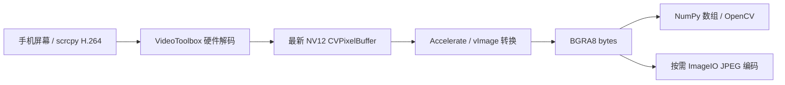
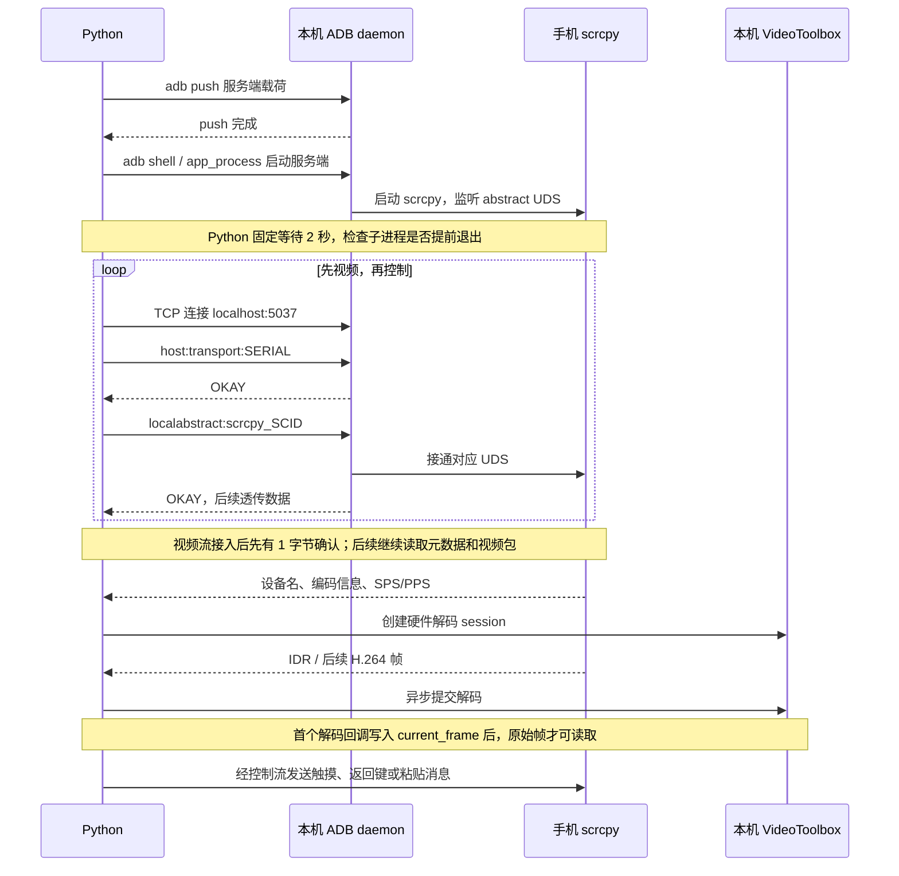

# 控制流程、等待时序与 BGRA8 取帧设计

本文解释当前 0.2.1 实现的执行顺序，以及等待、线程调度和像素格式选择的原因。模块总览见 [architecture.md](architecture.md)，开发约定见 [AGENTS.md](../AGENTS.md)。文中区分源码已实现的行为、作者说明的设计目标和仍需调用方保证的生命周期边界。

## 原始目标：为 OpenCV 频繁提供 BGRA8 帧

这个库最初就需要频繁获取手机屏幕的 BGRA8 原始像素，用作 OpenCV 的图像矩阵。解码后的帧数据是媒体层的基础输出，JPEG 是按需追加的编码步骤。后续开发应保留直接消费原始帧的路径，避免让 OpenCV 调用方先编码 JPEG，再将 JPEG 解码回像素矩阵。

当前处理链为：



两处加速各有职责：H.264 解码通过 VideoToolbox 要求硬件解码器；NV12 → BGRA8 通过 Accelerate/vImage 利用 CPU 向量处理能力执行原生转换。当前转换没有使用 Metal 或 GPU compute；这里的像素转换加速具体指 CPU SIMD 等底层优化。[Apple vImage 说明](https://developer.apple.com/documentation/accelerate/vimage-library)明确描述了其 CPU 向量处理模型。

「频繁取帧」是设计目标，不是已经测得的固定帧率保证。当前还存在像素分配/复制和 Python 层的解码器锁，不能将 JPEG 接口的使用建议、测试脚本的采样周期直接当作 BGRA8 通路的性能上限。

## 从推送服务端到建立两条连接

前置条件是已经执行 `init_lib()`：本机 ADB daemon 已启动，包内 `scrcpy-server.bin` 已释放到本机临时目录。对于 TCP 设备，`AndroidDevice.connect()` 还会先执行 `adb connect IP:端口`；USB 设备直接使用已有 transport。

### 1. 推送 DEX 载荷，启动手机端进程

[`AndroidDevice.connect()`](../src/adb_scr/device/android_device.py) 先等待 `adb push` 完成，将 scrcpy 服务端载荷写到手机 `/data/local/tmp/scrcpy-server.jar`。项目资源名为 `.bin`，手机端使用 `.jar` 路径，运行的是 scrcpy 的 Java/DEX 服务端入口。

[`start_scrcpy_server()`](../src/adb_scr/adb_cmd/device_control.py) 再通过 ADB shell 设置 `CLASSPATH`，用 `app_process / com.genymobile.scrcpy.Server` 启动进程。参数包括版本 `3.2`、每会话的 `scid`、`tunnel_forward=true`、`video=true`、`video_codec=h264`、`audio=false` 和 `control=true`。

在 forward 模式下，手机上的 scrcpy 创建并监听名为 `scrcpy_SCID` 的 abstract Unix domain socket，等待主机方向发起连接。scrcpy 3.2 的 [DesktopConnection.open()](https://github.com/Genymobile/scrcpy/blob/v3.2/server/src/main/java/com/genymobile/scrcpy/device/DesktopConnection.java) 按视频、音频、控制的启用顺序执行 `accept()`；本库关闭音频，因此需要依次接入视频和控制两条连接。

### 2. 通过 ADB 将本机 TCP 流接到手机 UDS

从用途看，ADB forward 建立的是「本机 TCP ↔ 手机 UDS」通路。当前库在 [`setup_tunnel()`](../src/adb_scr/device/tcp_forward_tunnel.py) 中直接与 ADB daemon 对话，具体顺序为：

1. Python 打开到本机 `localhost:5037` 的 TCP 连接。
2. 在该连接发送 `host:transport:SERIAL`，读取 ADB 的 `OKAY`，选中设备。
3. 继续发送 `localabstract:scrcpy_SCID`，读取 `OKAY`，请求接通手机 UDS。
4. 此后读写同一条 TCP 流，就经 ADB transport 读写手机上的 scrcpy socket。

每条 ADB 命令使用「4 位十六进制长度 + 命令字符串」封装。这里没有额外调用 `adb forward tcp:某端口 localabstract:...` 建立独立的本机监听端口；Python 是先连接 5037，再在连接内完成选设备和接 UDS 的请求。

`connect_sockets()` 按相同流程打开两次连接，分别保存为视频流和控制流。两次目标 UDS 名称相同，流用途由 scrcpy 的接入顺序决定。当前代码对 UDS 名称调用的 `replace("video", "control")` 不会改变实际的 `localabstract:scrcpy_SCID` 字符串。



图中的手机通信均通过 ADB。ADB 的 `OKAY` 确认隧道请求成功，scrcpy 视频流的首个 1 字节确认又是另一层握手；两者都不表示已经有可用的解码图像。

## 为什么需要等待

连接过程跨越本机 ADB 子进程、手机运行时、UDS、异步接收任务和硬件解码回调。这些阶段各自完成的时机不同。当前部分阶段采用固定延时留出执行时间，另一些阶段等待明确的操作完成。

| 位置 | 当前等待 | 等待的作用与实际边界 |
| --- | --- | --- |
| `start_scrcpy_server()` | 固定 `asyncio.sleep(2)` | 源码标注为「等待上线」。从调用顺序看，是给手机进程启动、加载入口并建立 UDS 留缓冲；随后只检查 ADB shell 子进程是否退出，没有探测 UDS 或首帧 ready。2 秒是当前实现的缓冲值，不是 scrcpy 协议规定的时长。 |
| `connect()` 返回后首次取尺寸/图像 | 库内不额外固定等待；README 示例等 0.5 秒 | 两条流已建立后，元数据、SPS/PPS、首个 IDR 和解码回调仍可能尚未完成。屏幕尺寸起初为 0，取帧可能返回 `None`。等待几百毫秒只是示例；调用方应以尺寸有效、取到帧为准，并给自己的等待设置截止时间。 |
| `disconnect_sockets()` 第一处 | 设置 `running=False` 后等 0.5 秒 | 给接收任务让出事件循环，使其有机会观察退出状态。阻塞在 `readexactly()` 的任务不会仅因标志改变就立即退出，后续仍要关闭流并取消任务。 |
| `disconnect_sockets()` 第二处 | 关闭流、`task.cancel()` 后再等 0.5 秒 | 给取消和连接收尾留缓冲，然后进入解码器清理。当前没有逐个等待取消后的任务或调用 `wait_closed()`；固定 sleep 不等于已经确认所有异步工作结束。 |
| `get_current_frame_bgra8()` | `dispatch_sync`，没有固定秒数 | 等待解码器串行队列轮到取帧，并在队列内完成 NV12 → BGRA8。耗时取决于队列工作和像素转换。 |
| `destroy_decoder()` | `VTDecompressionSessionWaitForAsynchronousFrames()`，没有固定秒数 | 等待 VideoToolbox 的异步/延迟帧处理完成，然后释放 session 等资源。[Apple API 说明](https://developer.apple.com/documentation/videotoolbox/vtdecompressionsessionwaitforasynchronousframes(_:))描述的是完成条件等待。 |
| TCP 设备连接与本机 ADB TCP 建连 | 分别最多 10 秒、5 秒 | `asyncio.wait_for()` 的超时上限；成功可以立即返回。5 秒只包围 `open_connection()`，没有覆盖后续所有 ADB 应答或首帧等待。 |
| `tests/test_run.py` | 滑动前等 3 秒；截图循环每轮等 1 秒 | 属于真机演示/稳定性测试的启动缓冲和采样节奏，库并未要求每帧等 1 秒，也未要求每次操作前等 3 秒。 |

手势中的毫秒级间隔还有不同用途：按下持续时间、双击间隔、滑动节点之间的节奏本身就是输入语义。`await writer.drain()` 只等待本机流的写入背压释放，也不保证手机 UI 已经处理完动作。

当前用 `asyncio.sleep()` 等待会让出事件循环，可让其他设备的任务继续运行。以后若调整这些时间，应先明确被等待的阶段，建立对应的 ready/完成信号；不能仅凭一次快速设备上的成功就推断所有等待都可以删除。

## 硬件解码器如何建立

Python 不在打开 socket 时凭屏幕宽高创建解码器，而是在视频流收到带配置标志的 SPS/PPS 包后创建。入口是 [`process_video_upstream()`](../src/adb_scr/device/control_handle.py) → 解码器工厂 → [`VtbH264Decoder`](../src/adb_scr/media_ext/h264/vtb_decoder.py) → [`vtb_create_decoder()`](../native_code/macOS/src/vtb_decoder.c)。

1. 拆分 Annex B 格式的 SPS/PPS，通过 `CMVideoFormatDescriptionCreateFromH264ParameterSets()` 创建格式描述，解析实际宽高。
2. 将 `kVTVideoDecoderSpecification_RequireHardwareAcceleratedVideoDecoder` 和 `kVTVideoDecoderSpecification_EnableHardwareAcceleratedVideoDecoder` 都设为 `true`。当前策略要求硬件解码；没有可用硬件解码器时创建失败，没有自动软件回退。[Apple 硬件要求说明](https://developer.apple.com/documentation/videotoolbox/kvtvideodecoderspecification_requirehardwareacceleratedvideodecoder)。
3. 指定输出为 `kCVPixelFormatType_420YpCbCr8BiPlanarVideoRange`，即 video-range NV12：一张 Y 平面加一张交错 CbCr 平面。
4. 创建 `VTDecompressionSession`，设置 `kVTDecompressionPropertyKey_RealTime=true`，表达实时解码用途；这是调度提示，不是延迟上限承诺。[Apple RealTime 说明](https://developer.apple.com/documentation/videotoolbox/kvtdecompressionpropertykey_realtime)。
5. 创建该解码器独立的 `DISPATCH_QUEUE_SERIAL` 队列，初始化 `current_frame=NULL`，把宽高和不透明句柄返回 Python。

普通帧经 NALU 格式转换后带微秒 PTS 提交给 VideoToolbox，启用 `kVTDecodeFrame_EnableAsynchronousDecompression`。入队成功表示接受了工作；真实图像稍后由输出回调送达。Python 包装层还会跳过首个 IDR 之前的非关键帧，避免从缺少参考的中间帧开始解码。

后续收到新的配置包时，控制句柄在解码器锁内关闭旧 session，再按新 SPS/PPS 创建 session；不能只修改宽高继续沿用旧格式。

## GCD 如何代替手写互斥锁管理帧

核心共享状态是 C 结构中的 `current_frame`，由 VideoToolbox 输出回调更新，由取帧调用读取。每个解码器建立一条串行队列，把这两种访问排到同一队列中。

### 写入最新帧

1. VideoToolbox 在回调中交付 `imageBuffer`。
2. 回调先 `CVPixelBufferRetain(imageBuffer)`，保证回调返回后、排队任务执行前，图像仍然存活。
3. 用 `dispatch_async(queue, ...)` 提交替换任务，回调无需同步等待该任务执行。
4. 队列任务释放旧 `current_frame`，将保留的新帧引用设为 `current_frame`。

### 读取当前帧

取帧通过 `dispatch_sync(queue, ...)` 进入同一队列：若当前帧为空则返回失败；否则读取当前 NV12 像素并完成 BGRA8 转换。转换期间，后续替换任务排在队列中，因此不会同时把正在读的帧释放掉。Python 随后取得独立的像素 `bytes`。

```text
同一个解码器的队列：
替换为帧 A → 读取/转换帧 A → 替换为帧 B → 替换为帧 C → 读取/转换帧 C
```

这种结构把共享数据的互斥访问交给串行调度，业务代码不必在读写 `current_frame` 周围手写 mutex。这里的「无锁」描述的是该组织方式，不是严格的 lock-free 算法保证：`dispatch_sync` 会等待；串行队列也不等于绑定某个固定线程。不能在同一队列的任务内部再次同步派发到自己。[Apple Dispatch Queues 指南](https://developer.apple.com/library/archive/documentation/General/Conceptual/ConcurrencyProgrammingGuide/OperationQueues/OperationQueues.html)说明了串行执行与同步派发的语义。

### 队列之外的生命周期仍要管理

- Python 的 `DeviceControlHandle._mutex` 仍负责协调解码器替换、入队、读取和销毁；GCD 对最新帧的串行访问不能替代句柄生命周期保护。
- 取帧和销毁通过 `asyncio.to_thread()` 调度，避免直接在事件循环线程等待 GCD/VideoToolbox；当前 C 扩展没有显式释放 GIL，不能据此推断 Python 计算完全不受影响。
- 当前销毁路径等待 VideoToolbox，再释放 session、帧、队列和结构体，但没有显式等待回调另外提交的 GCD 替换任务全部执行完成。因此「正常读写在队列内互斥」不等于已证明销毁阶段没有竞态。固定的 0.5 秒缓冲也不能作为这一保证；后续修改清理逻辑时需要核对回调、队列和句柄的存活顺序。

## NV12 快速转换为 BGRA8

实现位于 [`vth_nv12_to_bgra8()`](../native_code/macOS/src/vtb_helper.c)，以原生批量像素运算服务高频原始帧消费：

1. 验证输入是 video-range NV12，用 `CVPixelBufferLockBaseAddress(..., ReadOnly)` 配对解锁来访问像素内存。
2. 分别取得 Y、CbCr 平面地址和实际 `bytesPerRow`；输入可能有行对齐填充，不能简单假定每行等于图像宽度。
3. 用 `dispatch_once()` 只初始化一次转换参数。当前固定使用 ITU-R BT.709 矩阵及 video-range 的 Y/CbCr 参数，没有逐帧读取并适配其他色彩矩阵。
4. 为输出分配 `width × height × 4` 字节，调用 `vImageConvert_420Yp8_CbCr8ToARGB8888()`，用 `{3, 2, 1, 0}` 通道映射得到 BGRA，并将 alpha 设为 255。
5. 输出行宽为 `width × 4`。C 扩展通过 `PyBytes_FromStringAndSize()` 把结果复制成 Python `bytes`，再释放临时 C 缓冲区。

这样，Python 得到的是紧密排列的 BGRA8：每像素四个 `uint8`，内存通道顺序 B、G、R、A。NV12 到 BGRA8 的展开和颜色转换由系统原生向量实现承担，避免 Python 逐像素处理，也避免为图像分析额外引入 JPEG 有损压缩。

当前转换是在每次取帧时执行的，并且位于 GCD 串行队列内部。解码器保存的是最新 NV12 帧，没有持续预生成 BGRA8 队列；多次读取可能得到同一画面，也可能跳过消费间隔内出现的画面。每次取帧的 BGRA8 分配及 C → Python 复制仍有成本，整条链路并非零拷贝。

## BGRA8 到 OpenCV 的消费方式

现有调用链为 `DeviceControlHandle.get_current_frame()` → `H264DecoderBase.get_current_frame_bgra8()`，返回 `(width, height, bgra_bytes)` 或 `None`。它位于内部控制句柄/解码器层；`AndroidDevice` 当前公开的便捷取图方法是 `get_screenshot_jpg()`，没有独立的公开 BGRA8 方法。本文记录原有设计用途，不新增 API。

调用方取得有效的原始帧后，可以建立 OpenCV 所用的 NumPy 图像数组：

```python
import numpy as np


def frame_to_bgra_array(frame: tuple[int, int, bytes]) -> np.ndarray:
    width, height, bgra_bytes = frame
    return np.frombuffer(bgra_bytes, dtype=np.uint8).reshape(height, width, 4)
```

`numpy.frombuffer()` 在原始对象上创建视图，这一步可复用 Python `bytes` 的像素内存；以不可变 `bytes` 为底层的数组不可原地写入，需要可写数据时再 `.copy()`。视图不引用会被解码器替换的 `CVPixelBuffer`，其生命周期跟随 Python 对象。[NumPy frombuffer 文档](https://numpy.org/doc/stable/reference/generated/numpy.frombuffer.html)。

结果形状是 `(height, width, 4)`，不能直接按三通道 BGR reshape；需要 BGR 或灰度的 OpenCV 操作，应由调用方做明确的颜色转换。耗时的 OpenCV 分析应在取得帧、释放内部锁之后进行，避免占用负责收流和取帧的临界区。NumPy/OpenCV 由消费端按需安装，当前库没有将它们设为运行依赖。

## 后续 Agent 应保留的设计约束

- 保持视频、控制两次 UDS 接入的顺序与 scrcpy 配置一致；启用音频时需要重新核对连接协议。
- 区分隧道接通、元数据到达、解码器建立和首帧就绪；固定延时只为阶段间留缓冲。
- 保留原始 BGRA8 消费路径，让 JPEG 编码继续作为可选步骤。
- 修改 GCD 读写方式时同时检查引用所有权、销毁顺序与 Python 锁；不得仅以「使用了串行队列」推断所有并发路径安全。
- 描述性能时区分硬件 H.264 解码、CPU 向量像素转换、工作线程调度、数据复制和取帧频率；具体吞吐需要单独测量。

本文件与其他 `docs/` 内容一样，仅保留在仓库中，按 `MANIFEST.in` 的 `prune docs` 规则排除出发布包。
