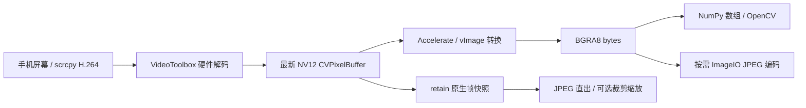
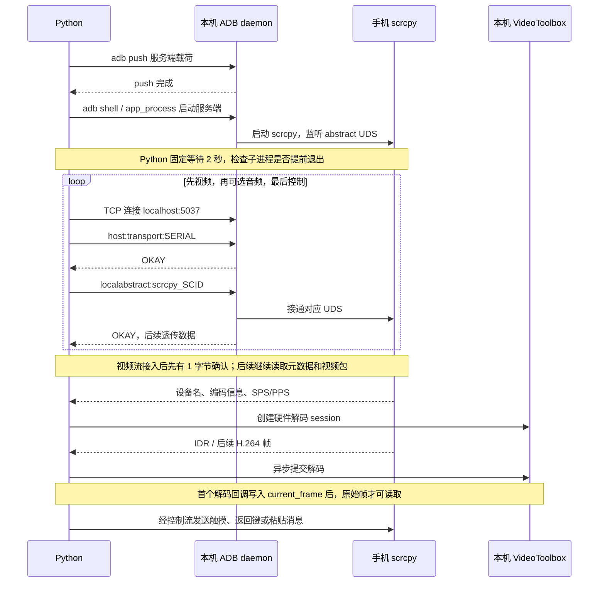

# 控制流程、等待时序与 BGRA8 取帧设计

本文解释当前实现的执行顺序，以及等待、线程调度和像素格式选择的原因。模块总览见 [architecture.md](architecture.md)，开发约定见 [AGENTS.md](../AGENTS.md)。文中区分源码已实现的行为、作者说明的设计目标和仍需调用方保证的生命周期边界。

## 原始目标：为 OpenCV 频繁提供 BGRA8 帧

这个库最初就需要频繁获取手机屏幕的 BGRA8 原始像素，用作 OpenCV 的图像矩阵。解码后的帧数据是媒体层的基础输出，JPEG 是按需追加的编码步骤。后续开发应保留直接消费原始帧的路径，避免让 OpenCV 调用方先编码 JPEG，再将 JPEG 解码回像素矩阵。

当前处理链为：



两处原始帧加速各有职责：H.264 解码通过 VideoToolbox 要求硬件解码器；NV12 → BGRA8 通过 Accelerate/vImage 利用 CPU 向量处理能力执行原生转换。BGRA8 通路没有改用 Metal 或 GPU compute；这里的像素转换加速具体指 CPU SIMD 等底层优化。[Apple vImage 说明](https://developer.apple.com/documentation/accelerate/vimage-library)明确描述了其 CPU 向量处理模型。新增 JPEG 直出则使用独立的 VideoToolbox/Core Image 路径，详见下文。

「频繁取帧」是设计目标，不是已经测得的固定帧率保证。当前还存在像素分配/复制和 Python 层的解码器锁，不能将 JPEG 接口的使用建议、测试脚本的采样周期直接当作 BGRA8 通路的性能上限。

## 从推送服务端到建立媒体与控制连接

前置条件是已经执行 `init_lib()`：本机 ADB daemon 已启动，包内 `scrcpy-server.bin` 已释放到本机临时目录。对于 TCP 设备，`AndroidDevice.connect()` 还会先执行 `adb connect IP:端口`；USB 设备直接使用已有 transport。

### 1. 推送 DEX 载荷，启动手机端进程

[`AndroidDevice.connect()`](../src/adb_scr/device/android_device.py) 先等待 `adb push` 完成，将 scrcpy 服务端载荷写到手机 `/data/local/tmp/scrcpy-server.jar`。项目资源名为 `.bin`，手机端使用 `.jar` 路径，运行的是 scrcpy 的 Java/DEX 服务端入口。

[`start_scrcpy_server()`](../src/adb_scr/adb_cmd/device_control.py) 再通过 ADB shell 设置 `CLASSPATH`，用 `app_process / com.genymobile.scrcpy.Server` 启动进程。参数包括版本 `3.2`、每会话的 `scid`、`tunnel_forward=true`、`video=true`、`video_codec=h264`、`control=true`，以及按 Android API 级别选择的音频参数。连接先通过 `getprop ro.build.version.sdk` 查询系统版本：API >= 33 使用 `audio=true audio_codec=aac audio_source=playback audio_dup=true`，30–32 使用 AAC/output 且不保留手机播放，低于 30 使用 `audio=false`。版本读取失败会触发连接回滚。

在 forward 模式下，手机上的 scrcpy 创建并监听名为 `scrcpy_SCID` 的 abstract Unix domain socket，等待主机方向发起连接。scrcpy 3.2 的 [DesktopConnection.open()](https://github.com/Genymobile/scrcpy/blob/v3.2/server/src/main/java/com/genymobile/scrcpy/device/DesktopConnection.java) 按视频、音频、控制的启用顺序执行 `accept()`；本库按同样的顺序接入启用的流；音频关闭时才只接视频和控制。

### 2. 通过 ADB 将本机 TCP 流接到手机 UDS

从用途看，ADB forward 建立的是「本机 TCP ↔ 手机 UDS」通路。当前库在 [`setup_tunnel()`](../src/adb_scr/device/tcp_forward_tunnel.py) 中直接与 ADB daemon 对话，具体顺序为：

1. Python 打开到本机 `localhost:5037` 的 TCP 连接。
2. 在该连接发送 `host:transport:SERIAL`，读取 ADB 的 `OKAY`，选中设备。
3. 继续发送 `localabstract:scrcpy_SCID`，读取 `OKAY`，请求接通手机 UDS。
4. 此后读写同一条 TCP 流，就经 ADB transport 读写手机上的 scrcpy socket。

每条 ADB 命令使用「4 位十六进制长度 + 命令字符串」封装。这里没有额外调用 `adb forward tcp:某端口 localabstract:...` 建立独立的本机监听端口；Python 是先连接 5037，再在连接内完成选设备和接 UDS 的请求。

`connect_sockets()` 按相同流程依次连接视频、可选音频和控制。目标 UDS 名称相同，流用途由 scrcpy 的接入顺序决定。所需流全部取得后才设置运行状态并启动接收任务，避免接收任务先退出、连接函数再将状态写回运行。音频启动时必须读取四字节编码器 ID 与 AAC 配置；ID 为 0 时表示服务端明确关闭音频，不误当作控制流或整个连接故障。



图中的手机通信均通过 ADB。ADB 的 `OKAY` 确认隧道请求成功，scrcpy 视频流的首个 1 字节确认又是另一层握手；两者都不表示已经有可用的解码图像。

## 为什么需要等待

连接过程跨越本机 ADB 子进程、手机运行时、UDS、异步接收任务和硬件解码回调。这些阶段各自完成的时机不同。服务端启动仍保留固定缓冲，连接就绪和退出清理则等待明确完成信号。

| 位置 | 当前等待 | 等待的作用与实际边界 |
| --- | --- | --- |
| `start_scrcpy_server()` | 固定 `asyncio.sleep(2)` | 源码标注为「等待上线」。从调用顺序看，是给手机进程启动、加载入口并建立 UDS 留缓冲；随后只检查 ADB shell 子进程是否退出，没有探测 UDS 或首帧 ready。2 秒是当前实现的缓冲值，不是 scrcpy 协议规定的时长。 |
| `connect()` 返回后首次取尺寸/图像 | 已等待有效元数据，但尚未保证首帧 | 取尺寸不再依赖固定 sleep；首帧由调用方在截止时间内检查。 |
| `disconnect_sockets()` | 取消并等待接收任务、关闭流、结束录制、关闭解码器 | 旧实现两处 0.5 秒缓冲已经替换为实际完成等待；固定时间不能证明资源已停止使用。 |
| `get_current_frame_bgra8()` | `dispatch_sync`，没有固定秒数 | 等待解码器串行队列轮到取帧，并在队列内完成 NV12 → BGRA8。耗时取决于队列工作和像素转换。 |
| `get_current_frame_jpg()` | 队列内 retain 快照，队列外等待编码 | 原生句柄锁保护编码器及关闭；VideoToolbox 等待输出回调或 Core Image 完成 JPEG 输出后返回。 |
| `destroy_decoder()` | VideoToolbox 完成等待，再同步排空 GCD 队列 | 先确保没有新的回调提交，再确认已提交的帧替换结束并释放最终帧；没有强制销毁超时。[Apple API 说明](https://developer.apple.com/documentation/videotoolbox/vtdecompressionsessionwaitforasynchronousframes(_:))。 |
| 设备连接与 I/O | `ConnectionOptions`：默认连接预算 30 秒，I/O 5 秒 | 覆盖隧道完整握手、元数据、半包和写入背压。静态画面间隔没有超时；主动 transport 探测负责补充 EOF/进程退出检测。 |
| `tests/test_run.py` | 滑动前等 3 秒；截图循环每轮等 1 秒 | 属于真机演示/稳定性测试的启动缓冲和采样节奏，库并未要求每帧等 1 秒，也未要求每次操作前等 3 秒。 |

手势中的毫秒级间隔还有不同用途：按下持续时间、双击间隔、滑动节点之间的节奏本身就是输入语义。`await writer.drain()` 只等待本机流的写入背压释放，也不保证手机 UI 已经处理完动作。

手势等待会让出事件循环，并同时等待会话停止信号；断连后提前结束等待，避免长按持有设备锁拖延资源回收。服务端的 2 秒启动缓冲仍保留，不能仅凭一次快速设备上的成功就删去。

## 硬件解码器如何建立

Python 不在打开 socket 时凭屏幕宽高创建解码器，而是在视频流收到带配置标志的 SPS/PPS 包后创建。入口是 [`process_video_upstream()`](../src/adb_scr/device/control_handle.py) → 解码器工厂 → [`VtbH264Decoder`](../src/adb_scr/media_ext/h264/vtb_decoder.py) → [`vtb_create_decoder()`](../native_code/macOS/src/vtb_decoder.c)。

1. 拆分 Annex B 格式的 SPS/PPS，通过 `CMVideoFormatDescriptionCreateFromH264ParameterSets()` 创建格式描述，解析实际宽高。
2. 将 `kVTVideoDecoderSpecification_RequireHardwareAcceleratedVideoDecoder` 和 `kVTVideoDecoderSpecification_EnableHardwareAcceleratedVideoDecoder` 都设为 `true`。当前策略要求硬件解码；没有可用硬件解码器时创建失败，没有自动软件回退。[Apple 硬件要求说明](https://developer.apple.com/documentation/videotoolbox/kvtvideodecoderspecification_requirehardwareacceleratedvideodecoder)。
3. 指定输出为 `kCVPixelFormatType_420YpCbCr8BiPlanarVideoRange`，即 video-range NV12：一张 Y 平面加一张交错 CbCr 平面。
4. 创建 `VTDecompressionSession`，设置 `kVTDecompressionPropertyKey_RealTime=true`，表达实时解码用途；这是调度提示，不是延迟上限承诺。[Apple RealTime 说明](https://developer.apple.com/documentation/videotoolbox/kvtdecompressionpropertykey_realtime)。
5. 创建该解码器独立的 `DISPATCH_QUEUE_SERIAL` 队列，初始化 `current_frame=NULL`，把宽高和不透明句柄返回 Python。

普通帧经 NALU 格式转换后带微秒 PTS 提交给 VideoToolbox，启用 `kVTDecodeFrame_EnableAsynchronousDecompression`。入队成功表示接受了工作；真实图像稍后由输出回调送达。Python 包装层还会跳过首个 IDR 之前的非关键帧，避免从缺少参考的中间帧开始解码。

后续收到新的配置包时，控制句柄在解码器锁内关闭旧 session，再按新 SPS/PPS 创建 session；不能只修改宽高继续沿用旧格式。

## GCD 如何代替手写互斥锁管理帧

核心共享状态是 C 结构中的 `current_frame`，由 VideoToolbox 输出回调更新，由取帧调用读取。每个解码器建立一条串行队列，把这两种访问排到同一队列中。

### 写入最新帧

1. VideoToolbox 在回调中交付 `imageBuffer`。
2. 回调先 `CVPixelBufferRetain(imageBuffer)`，保证回调返回后、排队任务执行前，图像仍然存活。
3. 用 `dispatch_async(queue, ...)` 提交替换任务，回调无需同步等待该任务执行。
4. 队列任务释放旧 `current_frame`，将保留的新帧引用设为 `current_frame`。

### 读取当前帧

BGRA8 取帧通过 `dispatch_sync(queue, ...)` 进入同一队列：若当前帧为空则返回失败；否则读取当前 NV12 像素并完成 BGRA8 转换。转换期间，后续替换任务排在队列中，因此不会同时把正在读的帧释放掉。Python 随后取得独立的像素 `bytes`。JPEG 直出仅在队列内 retain 最新帧，随后在队列外编码并释放快照；旧帧不会因新帧替换而提前销毁。

```text
同一个解码器的队列：
替换为帧 A → 读取/转换帧 A → 替换为帧 B → 替换为帧 C → 读取/转换帧 C
```

这种结构把共享数据的互斥访问交给串行调度，业务代码不必在读写 `current_frame` 周围手写 mutex。这里的「无锁」描述的是该组织方式，不是严格的 lock-free 算法保证：`dispatch_sync` 会等待；串行队列也不等于绑定某个固定线程。不能在同一队列的任务内部再次同步派发到自己。[Apple Dispatch Queues 指南](https://developer.apple.com/library/archive/documentation/General/Conceptual/ConcurrencyProgrammingGuide/OperationQueues/OperationQueues.html)说明了串行执行与同步派发的语义。

### 队列之外的生命周期仍要管理

- Python 的 `DeviceControlHandle._mutex` 仍负责协调解码器替换、入队、读取和销毁；GCD 对最新帧的串行访问不能替代句柄生命周期保护。
- 创建、取帧和销毁通过 `asyncio.to_thread()` 调度。原生句柄操作（含 JPEG 直出）先分离 Python 线程状态，再等待容器互斥锁；BGRA8 → JPEG 包装也在编码时分离线程状态。普通 CPython 下同时释放 GIL，free-threaded 下保留这一边界让 GC 能继续协调。取消协程时必须等待在途线程及资源安装完成，不能假定线程已终止。
- 当前销毁先等待 VideoToolbox 回调结束，再同步进入 GCD 队列释放最终帧，最后释放队列与结构体。旧实现漏等 GCD 任务，存在 use-after-free 风险；不得移除这一完成等待。Capsule 持有稳定容器，关闭清空容器指针，重复关闭和关闭后调用安全失败。

## NV12 快速转换为 BGRA8

实现位于 [`vth_nv12_to_bgra8()`](../native_code/macOS/src/vtb_helper.c)，以原生批量像素运算服务高频原始帧消费：

1. 验证输入是 video-range NV12，用 `CVPixelBufferLockBaseAddress(..., ReadOnly)` 配对解锁来访问像素内存。
2. 分别取得 Y、CbCr 平面地址和实际 `bytesPerRow`；输入可能有行对齐填充，不能简单假定每行等于图像宽度。
3. 用 `dispatch_once()` 只初始化一次转换参数。当前固定使用 ITU-R BT.709 矩阵及 video-range 的 Y/CbCr 参数，没有逐帧读取并适配其他色彩矩阵。
4. 为输出分配 `width × height × 4` 字节，调用 `vImageConvert_420Yp8_CbCr8ToARGB8888()`，用 `{3, 2, 1, 0}` 通道映射得到 BGRA，并将 alpha 设为 255。
5. 输出行宽为 `width × 4`。C 扩展通过 `PyBytes_FromStringAndSize()` 把结果复制成 Python `bytes`，再释放临时 C 缓冲区。

这样，Python 得到的是紧密排列的 BGRA8：每像素四个 `uint8`，内存通道顺序 B、G、R、A。NV12 到 BGRA8 的展开和颜色转换由系统原生向量实现承担，避免 Python 逐像素处理，也避免为图像分析额外引入 JPEG 有损压缩。

当前转换是在每次取帧时执行的，并且位于 GCD 串行队列内部。解码器保存的是最新 NV12 帧，没有持续预生成 BGRA8 队列；多次读取可能得到同一画面，也可能跳过消费间隔内出现的画面。每次取帧的 BGRA8 分配及 C → Python 复制仍有成本，整条链路并非零拷贝。

## BGRA8 到 OpenCV 的消费方式

现有调用链为 `DeviceControlHandle.get_current_frame()` → `H264DecoderBase.get_current_frame_bgra8()`，返回 `(width, height, bgra_bytes)` 或 `None`。它位于内部控制句柄/解码器层；`AndroidDevice` 公开 `get_screenshot_jpg()`，没有独立的公开 BGRA8 方法。

调用方取得有效的原始帧后，可以建立 OpenCV 所用的 NumPy 图像数组：

```python
import numpy as np


def frame_to_bgra_array(frame: tuple[int, int, bytes]) -> np.ndarray:
    width, height, bgra_bytes = frame
    return np.frombuffer(bgra_bytes, dtype=np.uint8).reshape(height, width, 4)
```

`numpy.frombuffer()` 在原始对象上创建视图，这一步可复用 Python `bytes` 的像素内存；以不可变 `bytes` 为底层的数组不可原地写入，需要可写数据时再 `.copy()`。视图不引用会被解码器替换的 `CVPixelBuffer`，其生命周期跟随 Python 对象。[NumPy frombuffer 文档](https://numpy.org/doc/stable/reference/generated/numpy.frombuffer.html)。

结果形状是 `(height, width, 4)`，不能直接按三通道 BGR reshape；需要 BGR 或灰度的 OpenCV 操作，应由调用方做明确的颜色转换。耗时的 OpenCV 分析应在取得帧、释放内部锁之后进行，避免占用负责收流和取帧的临界区。NumPy/OpenCV 由消费端按需安装，当前库没有将它们设为运行依赖。

## JPEG 直出与裁剪缩放

`get_screenshot_jpg(quality=75, scale=1.0, roi=None)` 通过控制句柄和解码器进入原生 `get_current_frame_jpg()`。公开截图方法名及原有 quality 参数调用方式保持不变，编码路径由内部选择。原始帧 API 和 `bgra8_to_jpg()` 工具函数继续保留；JPEG 只在请求时编码，不对所有解码帧预先压缩。

原比例整图优先尝试要求硬件加速的 JPEG session。会话按尺寸复用，每次编码更新质量，并使用递增时间戳；`VTCompressionSessionCompleteFrames(..., kCMTimeInvalid)` 等待所有输出后才释放输入快照。不能用“截图不是视频”为由对复用的编码会话反复传相同时间戳。

裁剪、缩放或硬件不可用时使用复用的 CIContext。ROI 是原图的 `(x, y, width, height)`；Core Image 坐标使用左下角，需将纵坐标转换为 `原图高度 - y - height`。先裁剪，再平移到原点、缩放并裁剪到取整后的输出边界。插值前扩展边缘，避免混入透明黑边。输出宽高分别按四舍五入计算，最少 1 像素。

Core Image 能从 CVPixelBuffer 读取 YUV，在 Metal 可用时使用 Metal 上下文；没有 Metal 设备时使用软件上下文。该路径并不保证 JPEG 压缩全程由 GPU 完成。输出使用 sRGB，系统读取输入色彩信息；不要求不同编码器在相同质量参数下输出相同画质。公开参数和错误约定见 [API 参考](api.md#尺寸与截图)。

JPEG 编码器属于 Capsule，由原生句柄锁保护，关闭时完成编码并释放 session、CIContext 和色彩空间。JPEG bytes 已复制出来，因此解码器随后销毁不影响调用方保存的图片。扩展支持 free-threaded CPython；同一句柄仍串行，不同句柄可并行。Python 设备对象继续在同一 asyncio 事件循环内使用，不能将 asyncio 锁视为跨线程锁。

## 后续 Agent 应保留的设计约束

- 保持视频、可选音频、控制的 UDS 接入顺序与 scrcpy 配置一致；三条流数量和服务端参数必须来自同一次 API 级别判定。
- 区分隧道接通、元数据到达、解码器建立和首帧就绪；固定延时只为阶段间留缓冲。
- 保留原始 BGRA8 消费路径，让 JPEG 编码继续作为可选步骤。
- 修改 GCD 读写方式时同时检查引用所有权、销毁顺序与 Python 锁；不得仅以「使用了串行队列」推断所有并发路径安全。
- 描述性能时区分硬件 H.264 解码、CPU 向量像素转换、工作线程调度、数据复制和取帧频率；具体吞吐需要单独测量。

本文件与其他 `docs/` 内容一样，仅保留在仓库中，按 `MANIFEST.in` 的 `prune docs` 规则排除出发布包。


## 屏幕录制与静止画面

视频录制订阅 VideoToolbox 输出的 NV12 CVPixelBuffer。首帧直接使用现有缓存快照，由独立硬件 H.264 session 强制生成关键帧；不等待上游 IDR，也不走 BGRA8/Python/JPEG 转换。后续画面通过原生观察者 retain 后提交到录制队列。观察者仅提交工作，不在解码器帧队列内等待编码或磁盘写入。

录制保留实时编码、预期帧率、禁止帧重排和色彩描述；码率、画质、编码 Profile 与关键帧间隔使用 VideoToolbox 默认值，不设置速度优先提示。此前的 256 kbps 目标码率会使高分辨率画面明显模糊，因此根据真机反馈移除；不保证跨设备相同画质或码率。输出画布固定为开始时尺寸，尺寸变化由原生 Core Image 路径等比适配并居中留黑，原尺寸画面保留直接输入路径。AAC AudioSpecificConfig 与原始压缩包交由 CoreMedia/AVAssetWriter 封装，AudioToolbox 仅参与格式描述，不解码或重新编码音频。

AAC 直通需要显式处理 AVAssetWriter 的 encoder-delay 元数据，不能只给首包设置零裁剪。原生层为开头的包组提供 priming/输出时间，并在结束时用压缩包填充和尾部裁剪补齐封装器的预填充区间；附加填充位于播放区间之外。连续音频的验证逐包比较原始 AAC 内容与 MP4 包哈希、PTS，并用 AVAssetReader 核对有效音频起止，避免文件能播放但整体偏移 44 ms 的情况。

AVAssetWriter 的 AAC 直通会按连续采样时钟写包，不能依靠逐包 PTS 或 EmptyMedia marker 自动保留间隔。原生层允许一包以内的时间抖动，记录超过一包的向前跳变；结束后仅为有间隔的文件建立临时副本，用 AVMutableMovieTrack 插入空白时间段，再以 MPEG-4 格式写入头部并原子替换。视频和 AAC 数据保持压缩内容不变。movie timescale 使用 1,000,000，避免多段空白累计按默认 600 刻度取整。间隔元数据最多 4096 项；超过上限或向后重叠超过一包会报告失败。带间隔的音轨可能含解码预填充引用，验证必须结合原始包存储和 Apple 播放时间区间，不能把预填充引用误判成可听见的重复声音。

录制器独立持有缓存画面。没有画面更新时不要求手机发送重复帧；停止时使用保留的尾帧补齐持续时间，并等待 VideoToolbox 和 MP4 writer 完成。编码队列有界，繁忙时可以跳过中间视频帧，但不能静默丢弃音频后谎报成功。原生层在停止后拒绝新提交，观察者解绑、异步工作和最终资源释放都必须遵循引用所有权。

手机端音频采集从连接时就开始。Android 13+ 的 playback + audio_dup 保留手机播放，Android 11–12L 的 output 会使手机静音；后者的停止录制仅停止写文件，不会关闭整个会话或恢复音频路由。音频不可用的旧系统仍可录制纯视频。应用是否允许采集以及设备 ROM 的实际表现需要真机验证。
